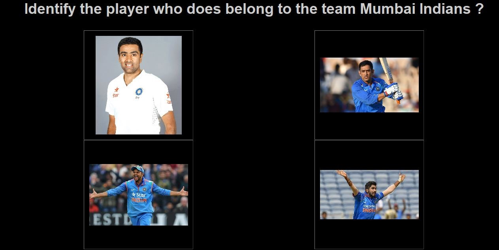
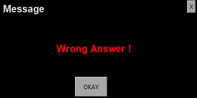

# Questionary
Python version: 3.6.8
  Dlib version: 19.8.1
 
 This project has two parts:-
1) creating a database
2) creating question with appropriate options, and a single correct answer
3) populating the question, options into GUI, and providing messages on selection of an option.
 
  <b> Part 1 </b>
 A list of player with details is required, with name of the players under the column 'Player'.
 The file format must be in .csv
 Using the list of names from the column 'Player'. Images of the players are downloaded.(Note: one can set the 'Usage Rights' for the images to be downloaded.)
 There are two image repository that is created: 
1) with only the faces of players, which is pickled 
2) with players(not specified for face images)
 All the images in the <u> second repository </u> are screened for the presence of a single player and then screened to recognise the faces using the respective pickle file.
 This forms the database of images for all the players.
 
 <b> Part 2 </b>
 Questions are generated using question.csv(.csv file format is mandatory). The question.csv has mandatory columns: question, tag, not_flag.
Using the combination, questions are generated.
 
 Using <u> tag </u>, appropriate columns are populated, and corresponding image for each option is selected.(Note: Only one option is a correct answer.)
 
 <b> Part 3 </b>
 Using tkinter, quesion and the corresponding options are populated on the screen. On selection of an option, a pop-up box with message appears.
 
 

 

